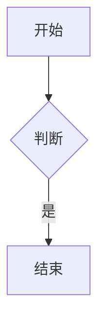

```mermaid
graph TD
  A[开始] --> B{判断}
  B -->|是| C[结束]
```

```flow
st=>start: 开始
e=>end: 结束
st->e
```

```sequence
A->B: 请求
B->A: 响应
```

行内公式 $a^2 + b^2 = c^2$ 与块级公式：

$$
\int_0^1 x^2\,dx
$$

```math
E = mc^2
```
